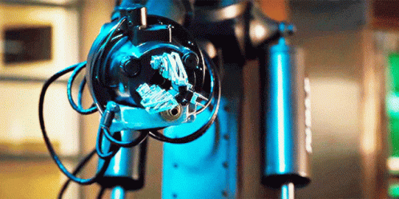
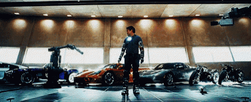
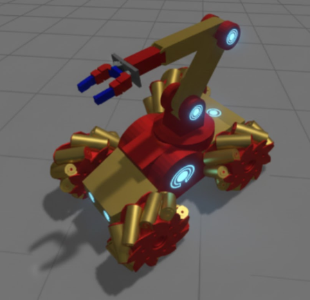

[//]: # (Image References)

[image1]: ./assets/starter-package.png "Starter package"
[image2]: ./assets/starter-package-1.png "Starter package"
[image3]: ./assets/links.png "Links"
[image4]: ./assets/shoulder.png "Shoulder"
[image5]: ./assets/joint-states.png "Joint states"
[image6]: ./assets/elbow.png "Elbow"
[image7]: ./assets/wrist.png "Wrist"
[image8]: ./assets/gripper.png "Gripper"
[image9]: ./assets/joint-states-1.png "Joint states"
[image10]: ./assets/joint-trajectory-controller.png "Joint trajectory"
[image11]: ./assets/joint-states-2.png "Joint states"
[image12]: ./assets/3d-models.png "3D models"
[image13]: ./assets/grabbing.png "Grabbing with friction"
[image14]: ./assets/grabbing-1.png "Grabbing with fix joint"
[image15]: ./assets/contact-sensor.png "Contact sensor"
[image16]: ./assets/end-effector.png "End effector"
[image17]: ./assets/gripper-camera.png "Gripper camera"
[image18]: ./assets/table-camera.png "Table camera"
[image19]: ./assets/rgbd-camera.png "Table RGBD camera"
[image20]: ./assets/rqt-arm-controller.png "arm_controller"
[image21]: ./assets/joint-angles.png "Joint angles"
[image22]: ./assets/joint-angles-1.png "Joint angles"
[image23]: ./assets/ik_3.png "Inverse kinematics"
[image24]: ./assets/ik_2.png "Inverse kinematics"
[image25]: ./assets/ik_1.png "Inverse kinematics"
[image26]: ./assets/inverse-kinematics.png "Inverse kinematics"
[image27]: ./assets/separate-controller.png "Separate controllers"
[image28]: ./assets/moveit.png "MoveIt"
[image29]: ./assets/moveit-1.png "MoveIt"
[image30]: ./assets/moveit-2.png "MoveIt"
[image31]: ./assets/moveit-3.png "MoveIt"
[image32]: ./assets/moveit-4.png "MoveIt"
[image33]: ./assets/moveit-5.png "MoveIt"
[image34]: ./assets/moveit-6.png "MoveIt"
[image35]: ./assets/moveit-7.png "MoveIt"
[image36]: ./assets/moveit-8.png "MoveIt"
[image37]: ./assets/moveit-9.png "MoveIt"
[image38]: ./assets/moveit-10.png "MoveIt"
[image39]: ./assets/moveit-11.png "MoveIt"
[image40]: ./assets/moveit-12.png "MoveIt"
[image41]: ./assets/moveit-13.png "MoveIt"
[image42]: ./assets/moveit-14.png "MoveIt"
[image43]: ./assets/moveit-15.png "MoveIt"
[image44]: ./assets/moveit-16.png "MoveIt"
[image45]: ./assets/moveit-17.png "MoveIt"
[image46]: ./assets/moveit-18.png "MoveIt"
[image47]: ./assets/moveit-19.png "MoveIt"
[image48]: ./assets/moveit-20.png "MoveIt"
[image49]: ./assets/moveit-21.png "MoveIt"
[image50]: ./assets/moveit-22.png "MoveIt"
[image51]: ./assets/moveit-23.png "MoveIt"
[image52]: ./assets/moveit-24.png "MoveIt"
[image53]: ./assets/moveit-25.png "MoveIt"
[image54]: ./assets/moveit-26.png "MoveIt"

# Week 4: Simple Robotic arm

# Introduction

In this lesson, we’re stepping straight into Stark’s workshop mode. Not theory. Not spectator mode. You’re going to build a four-axis robotic arm the way Tony would — piece by piece, joint by joint, tightening bolts with one hand while running math in your head with the other. This isn’t a kit you “assemble.” It’s a system you engineer.

But the real magic isn’t the metal — it’s the mind you put inside it.

You won’t just download someone else’s solution. You’ll design your own inverse kinematics — your personal targeting computer, the same class of math that lets a suit align repulsors, stabilize flight vectors, and hit exactly what it intends to. Your custom ROS 2 nodes become the nervous system, firing commands like Stark-grade neural impulses, turning coordinates into controlled motion.

By the end, the arm won’t just move.

It will obey geometry, respect physics, and execute with Stark-level precision —
not because it has to… but because you built it to.

Let's get started!

  

## Download ROS package

To download the starter package, clone the following git repo into your colcon workspace:
```bash
git clone https://github.com/Aswath0929/WinteROS_Week4final1
```

Let's take a look what's inside the `erc_ros2_simple_arm` package with the `tree` command!


```bash
.
├── CMakeLists.txt
├── package.xml
├── config
│   ├── controller_position.yaml
│   └── gz_bridge.yaml
├── launch
│   ├── check_urdf.launch.py
│   ├── spawn_robot.launch.py
│   └── world.launch.py
├── meshes
│   ├── forearm.blend
│   ├── forearm.dae
│   ├── forearm.SLDPRT
│   ├── forearm.STEP
│   ├── forearm.STL
│   ├── shoulder.blend
│   ├── shoulder.dae
│   ├── shoulder.SLDPRT
│   ├── shoulder.STEP
│   ├── shoulder.STL
│   ├── upper_arm.blend
│   ├── upper_arm.dae
│   ├── upper_arm.SLDPRT
│   ├── upper_arm.STEP
│   ├── upper_arm.STL
│   ├── wrist.blend
│   ├── wrist.dae
│   ├── wrist.SLDPRT
│   ├── wrist.STEP
│   └── wrist.STL
├── rviz
│   ├── rviz.rviz
│   └── urdf.rviz
├── urdf
│   ├── materials.xacro
│   └── mogi_arm.xacro
└── worlds
    ├── empty.sdf
    └── world.sdf
```

Let's see what will we do with the existing files and folders:
- `config`: As we saw previously, we usually store parameters and large configuration files for ROS packages which aren't comfortable to handle from the launchfiles directly. In this lesson we will use configuration files for the `gz_bridge` and the position controller of the robotic arm.
- `launch`: Default launch files are already part of the starting package, we can test the package with `spawn_robot.launch.py`.
- `meshes`: this folder contains the 3D models in SolidWorks, Blender and exported `dae` format (collada mesh) that we use for our robot's links.
- `rviz`: Pre-configured RViz2 layouts
- `urdf`: The URDF models of our robot, we'll extend the `mogi_arm.xacro` during this lesson
- `worlds`: default Gazebo worlds that we'll use in the simulations.

We have another package `erc_ros2_simple_arm_py` for our python scripts:
```bash
.
├── erc_ros2_simple_arm_py
│   ├── __init__.py
│   └── test_inverse_kinematics.py
├── package.xml
├── resource
│   └── erc_ros2_simple_arm_py
├── setup.cfg
└── setup.py
```

## Test the starter package

After we downloaded the `starter-branch` from GitHub, let's rebuild the workspace and source the `install/setup.bash` file to make sure ROS and its tools are aware about the new package.

Let's test the package with the usual launch file:
```bash
ros2 launch erc_ros2_simple_arm spawn_robot.launch.py
```

![alt text][image1]

# Building the robotic arm

The base of the robotic arm is already in the URDF file, but the colors in RViz and Gazebo doesn't match. Before we move forward let's fix this, include the materials in the URDF file:

```xml
  <!-- STEP 3 - RViz colors -->
  <xacro:include filename="$(find erc_ros2_simple_arm)/urdf/materials.xacro" />
```
![alt text][image2]

Now we can proceed to adding the links of the robotic arm! We'll add the following links:

![alt text][image3]

## Shoulder

The shoulder of our robot is actually not 1 but 2 links, one for the pan and the other for lift. Let's add it to the URDF file:

```xml
  <!-- STEP 4 - Shoulder -->
  <joint name="shoulder_pan_joint" type="revolute">
    <limit lower="-3.14" upper="3.14" effort="330.0" velocity="3.14"/>
    <parent link="base_link"/>
    <child link="shoulder_link"/>
    <axis xyz="0 0 1"/>
    <origin xyz="0.0 0.0 0.05" rpy="0.0 0.0 0.0"/>
    <dynamics damping="0.0" friction="0.0"/>
  </joint>

  <!-- Shoulder link -->
  <link name="shoulder_link">
    <inertial>
      <mass value="0.5"/>
      <origin xyz="0.0 0.0 0.0" rpy="0.0 0.0 0.0"/>
      <inertia ixx="0.0014" ixy="0.0" ixz="0.0"
               iyy="0.0014" iyz="0.0"
               izz="0.0025"
      />
    </inertial>
    <collision>
      <geometry>
        <cylinder radius="0.1" length="0.05"/>
      </geometry>
      <origin xyz="0.0 0.0 0.0" rpy="0.0 0.0 0.0"/>
    </collision>
    <visual>
      <geometry>
        <cylinder radius="0.1" length="0.05"/>
      </geometry>
      <material name="orange"/>
      <origin xyz="0.0 0.0 0.0" rpy="0.0 0.0 0.0"/>
    </visual>
  </link>

  <!-- Shoulder lift joint -->
  <joint name="shoulder_lift_joint" type="revolute">
    <limit lower="-1.5708" upper="1.5708" effort="330.0" velocity="3.14"/>
    <parent link="shoulder_link"/>
    <child link="upper_arm_link"/>
    <axis xyz="0 1 0"/>
    <origin xyz="0.0 0.0 0.025" rpy="0.0 0.0 0.0"/>
    <dynamics damping="0.0" friction="0.0"/>
  </joint>

  <!-- Upper arm link -->
  <link name="upper_arm_link">
    <inertial>
      <mass value="0.3"/>
      <origin xyz="0.0 0.0 0.1" rpy="0.0 0.0 0.0"/>
      <inertia ixx="0.0012" ixy="0.0" ixz="0.0"
               iyy="0.0012" iyz="0.0"
               izz="0.0004"
      />
    </inertial>
    <collision>
      <geometry>
        <cylinder radius="0.05" length="0.2"/>
      </geometry>
      <origin xyz="0.0 0.0 0.1" rpy="0.0 0.0 0.0"/>
    </collision>
    <visual>
      <geometry>
        <cylinder radius="0.05" length="0.2"/>
      </geometry>
      <material name="orange"/>
      <origin xyz="0.0 0.0 0.1" rpy="0.0 0.0 0.0"/>
    </visual>
  </link>
```

Rebuild the workspace and try it:
```bash
ros2 launch erc_ros2_simple_arm spawn_robot.launch.py
```

![alt text][image4]

Joint state publisher opens a small GUI where we can adjust the angles of the two new shoulder joints, but this has clearly no impact on the simulation. Let's take a look on `rqt_graph`, it's clear that the `joint_states` are not coming from the simulation. We'll handle this a bit later.

![alt text][image5]

## Elbow

Let's add the elbow that is the connecting joint between upper arm and forearm.

```xml
  <!-- STEP 5 - Elbow -->
  <joint name="elbow_joint" type="revolute">
    <limit lower="-2.3562" upper="2.3562" effort="150.0" velocity="3.14"/>
    <parent link="upper_arm_link"/>
    <child link="forearm_link"/>
    <axis xyz="0 1 0"/>
    <origin xyz="0.0 0.0 0.2" rpy="0.0 0.0 0.0"/>
    <dynamics damping="0.0" friction="0.0"/>
  </joint>

  <!-- Forearm link -->
  <link name="forearm_link">
    <inertial>
      <mass value="0.2"/>
      <origin xyz="0.0 0.0 0.125" rpy="0.0 0.0 0.0"/>
      <inertia ixx="0.0011" ixy="0.0" ixz="0.0"
               iyy="0.0011" iyz="0.0"
               izz="0.0004"
      />
    </inertial>
    <collision>
      <geometry>
        <cylinder radius="0.025" length="0.25"/>
      </geometry>
      <origin xyz="0.0 0.0 0.125" rpy="0.0 0.0 0.0"/>
    </collision>
    <visual>
      <geometry>
        <cylinder radius="0.025" length="0.25"/>
      </geometry>
      <material name="orange"/>
      <origin xyz="0.0 0.0 0.125" rpy="0.0 0.0 0.0"/>
    </visual>
  </link>
```

Rebuild the workspace and try it:
```bash
ros2 launch erc_ros2_simple_arm spawn_robot.launch.py
```

![alt text][image6]

## Wrist

Now add the wrist of the robotic arm:

```xml
  <!-- STEP 6 - Wrist -->
  <joint name="wrist_joint" type="revolute">
    <limit lower="-2.3562" upper="2.3562" effort="54.0" velocity="3.14"/>
    <parent link="forearm_link"/>
    <child link="wrist_link"/>
    <axis xyz="0 1 0"/>
    <origin xyz="0.0 0.0 0.25" rpy="0.0 0.0 0.0"/>
    <dynamics damping="0.0" friction="0.0"/>
  </joint>

  <!-- Wrist link -->
  <link name="wrist_link">
    <inertial>
      <mass value="0.1"/>
      <origin xyz="0.0 0.0 0.05" rpy="0.0 0.0 0.0"/>
      <inertia ixx="0.00009" ixy="0.0" ixz="0.0"
               iyy="0.00009" iyz="0.0"
               izz="0.00002"
      />
    </inertial>
    <collision>
      <geometry>
        <cylinder radius="0.02" length="0.1"/>
      </geometry>
      <origin xyz="0.0 0.0 0.05" rpy="0.0 0.0 0.0"/>
    </collision>
    <visual>
      <geometry>
        <cylinder radius="0.02" length="0.1"/>
      </geometry>
      <material name="orange"/>
      <origin xyz="0.0 0.0 0.05" rpy="0.0 0.0 0.0"/>
    </visual>
  </link>
```

Rebuild the workspace and try it:
```bash
ros2 launch erc_ros2_simple_arm spawn_robot.launch.py
```

![alt text][image7]


## Gripper

And finally add a gripper. The gripper conists of a base and two fingers. The fingers are connected with prismatic joints to the base. Also we improve the friction parameters of the fingers in the simulation:

```xml
  <!-- STEP 7 - Gripper -->
  <joint name="gripper_base_joint" type="fixed">
    <parent link="wrist_link"/>
    <child link="gripper_base"/>
    <origin xyz="0.0 0 0.105" rpy="0.0 0 0"/> 
  </joint>

  <!-- Gripper base link -->
  <link name="gripper_base">
    <inertial>
      <mass value="0.1"/>
      <origin xyz="0.0 0.0 0.0" rpy="0.0 0.0 0.0"/>
      <inertia ixx="0.00009" ixy="0.0" ixz="0.0"
               iyy="0.00009" iyz="0.0"
               izz="0.00002"
      />
    </inertial>
    <collision>
      <geometry>
        <box size=".05 .1 .01"/>
      </geometry>
      <origin xyz="0.0 0.0 0.0" rpy="0.0 0.0 0.0"/>
    </collision>
    <visual>
      <geometry>
        <box size=".05 .1 .01"/>
      </geometry>
      <material name="grey"/>
      <origin xyz="0.0 0.0 0.0" rpy="0.0 0.0 0.0"/>
    </visual>
  </link>

  <!-- Left finger joint -->
  <joint name="left_finger_joint" type="prismatic">
    <limit lower="0" upper="0.04" effort="100.0" velocity="4.0"/>
    <parent link="gripper_base"/>
    <child link="left_finger"/>
    <axis xyz="0 1 0"/>
    <origin xyz="0.0 0.01 0.045" />
  </joint>

  <!-- Left finger link -->
  <link name="left_finger">
    <inertial>
      <mass value="0.1"/>
      <origin xyz="0.0 0.0 0.0" rpy="0.0 0.0 0.0"/>
      <inertia ixx="0.00009" ixy="0.0" ixz="0.0"
               iyy="0.00009" iyz="0.0"
               izz="0.00002"
      />
    </inertial>
    <collision>
      <geometry>
        <box size=".04 .01 .08"/>
      </geometry>
      <origin xyz="0.0 0.0 0.0" rpy="0.0 0.0 0.0"/>
    </collision>
    <visual>
      <geometry>
        <box size=".04 .01 .08"/>
      </geometry>
      <material name="blue"/>
      <origin xyz="0.0 0.0 0.0" rpy="0.0 0.0 0.0"/>
    </visual>
  </link>

  <gazebo reference="left_finger">
    <kp>1000000.0</kp>
    <kd>100.0</kd>
    <mu1>15</mu1>
    <mu2>15</mu2>
    <fdir1>1 0 0</fdir1>
    <maxVel>1.0</maxVel>
    <minDepth>0.002</minDepth>
  </gazebo>

  <!-- Right finger joint -->
  <joint name="right_finger_joint" type="prismatic">
    <limit lower="0" upper="0.04" effort="100.0" velocity="4.0"/>
    <parent link="gripper_base"/>
    <child link="right_finger"/>
    <axis xyz="0 -1 0"/>
    <origin xyz="0.0 -0.01 0.045" />
  </joint>

  <!-- Right finger link -->
  <link name="right_finger">
    <inertial>
      <mass value="0.1"/>
      <origin xyz="0.0 0.0 0.0" rpy="0.0 0.0 0.0"/>
      <inertia ixx="0.00009" ixy="0.0" ixz="0.0"
               iyy="0.00009" iyz="0.0"
               izz="0.00002"
      />
    </inertial>
    <collision>
      <geometry>
        <box size=".04 .01 .08"/>
      </geometry>
      <origin xyz="0.0 0.0 0.0" rpy="0.0 0.0 0.0"/>
    </collision>
    <visual>
      <geometry>
        <box size=".04 .01 .08"/>
      </geometry>
      <material name="blue"/>
      <origin xyz="0.0 0.0 0.0" rpy="0.0 0.0 0.0"/>
    </visual>
  </link>

  <gazebo reference="right_finger">
    <kp>1000000.0</kp>
    <kd>100.0</kd>
    <mu1>15</mu1>
    <mu2>15</mu2>
    <fdir1>1 0 0</fdir1>
    <maxVel>1.0</maxVel>
    <minDepth>0.002</minDepth>
  </gazebo>
```

Rebuild the workspace and try it:
```bash
ros2 launch erc_ros2_simple_arm spawn_robot.launch.py
```

![alt text][image8]


## Joint state publishing

As we noticed earlier, we can move the joint angles of the robotic arm in RViz using the `joint_state_publisher_gui` but this has no impact on the simulation. To move the arm in the simulation first we have to turn off the `joint_state_publisher_gui` in the `spawn_robot.launch.py`, it means the small GUI won't open anymore using this launch file.

The next step is to forward `joint_states` from Gazebo to ROS, this we can set up in the config file of `gz_bridge` as we did previously with the mobile robots too:

```yaml
- ros_topic_name: "joint_states"
  gz_topic_name: "joint_states"
  ros_type_name: "sensor_msgs/msg/JointState"
  gz_type_name: "gz.msgs.Model"
  direction: "GZ_TO_ROS"
```

And the last step is to add a `mogi_arm.gazebo` file in the urdf folder with a joint state publisher plugin:
```xml
<robot>
  <gazebo>
    <plugin
        filename="gz-sim-joint-state-publisher-system"
        name="gz::sim::systems::JointStatePublisher">
        <topic>joint_states</topic>
        <joint_name>shoulder_pan_joint</joint_name>
        <joint_name>shoulder_lift_joint</joint_name>
        <joint_name>elbow_joint</joint_name>
        <joint_name>wrist_joint</joint_name>
        <joint_name>left_finger_joint</joint_name>
        <joint_name>right_finger_joint</joint_name>
    </plugin>
  </gazebo>
</robot>
```

And of course, include it in the beginning of our URDF file:

```xml
  <!-- STEP 8 - Gazebo plugin -->
  <xacro:include filename="$(find erc_ros2_simple_arm)/urdf/mogi_arm.gazebo" />
```

Rebuild the workspace and try it together with `rqt_graph`:
```bash
ros2 launch erc_ros2_simple_arm spawn_robot.launch.py
```

![alt text][image9]

Now the `joint_states` are coming from the simulation but we stil ldon't have the tools to move the arm.

# ROS Controller

Joint angles are important, but this still doesn't mean that we simulate any actuators in these joints with Gazebo. And here comes the `ROS2 control` and it's controllers for every joints. Let's add it to our URDF file:

```xml
  <!-- STEP 9 - ROS2 control -->
  <ros2_control name="GazeboSystem" type="system">
    <hardware>
      <plugin>gz_ros2_control/GazeboSimSystem</plugin>
    </hardware>
    <joint name="shoulder_pan_joint">
      <command_interface name="position">
        <param name="min">-2</param>
        <param name="max">2</param>
      </command_interface>
      <state_interface name="position">
        <param name="initial_value">0.0</param>
      </state_interface>
      <state_interface name="velocity"/>
      <state_interface name="effort"/>
    </joint>
    <joint name="shoulder_lift_joint">
      <command_interface name="position">
        <param name="min">-2</param>
        <param name="max">2</param>
      </command_interface>
      <state_interface name="position">
        <param name="initial_value">0.0</param>
      </state_interface>
      <state_interface name="velocity"/>
      <state_interface name="effort"/>
    </joint>
    <joint name="elbow_joint">
      <command_interface name="position">
        <param name="min">-2</param>
        <param name="max">2</param>
      </command_interface>
      <state_interface name="position">
        <param name="initial_value">0.0</param>
      </state_interface>
      <state_interface name="velocity"/>
      <state_interface name="effort"/>
    </joint>
    <joint name="wrist_joint">
      <command_interface name="position">
        <param name="min">-2</param>
        <param name="max">2</param>
      </command_interface>
      <state_interface name="position">
        <param name="initial_value">0.0</param>
      </state_interface>
      <state_interface name="velocity"/>
      <state_interface name="effort"/>
    </joint>
    <joint name="left_finger_joint">
      <command_interface name="position">
        <param name="min">-2</param>
        <param name="max">2</param>
      </command_interface>
      <state_interface name="position">
        <param name="initial_value">0.0</param>
      </state_interface>
      <state_interface name="velocity"/>
      <state_interface name="effort"/>
    </joint>
    <joint name="right_finger_joint">
      <command_interface name="position">
        <param name="min">-2</param>
        <param name="max">2</param>
      </command_interface>
      <state_interface name="position">
        <param name="initial_value">0.0</param>
      </state_interface>
      <state_interface name="velocity"/>
      <state_interface name="effort"/>
    </joint>
  </ros2_control>
```

We also have to add the `ROS2 control` to the `mogi_arm.gazebo` file:

```xml
  <gazebo>
    <plugin filename="gz_ros2_control-system" name="gz_ros2_control::GazeboSimROS2ControlPlugin">
      <parameters>$(find erc_ros2_simple_arm)/config/controller_position.yaml</parameters>
    </plugin>
  </gazebo>
```

The controller needs a `yaml` file with it's parameters that is already part of the package:
```yaml
controller_manager:
  ros__parameters:
    update_rate: 1000  # Hz

    joint_state_broadcaster:
      type: joint_state_broadcaster/JointStateBroadcaster

arm_controller:
  ros__parameters:
    type: joint_trajectory_controller/JointTrajectoryController
    joints:
      - shoulder_pan_joint
      - shoulder_lift_joint
      - elbow_joint
      - wrist_joint
      - left_finger_joint
      - right_finger_joint
    command_interfaces:
      - position
    state_interfaces:
      - position
      - velocity
```

And finally we have to start the controller in our launch file.

```python
    joint_trajectory_controller_spawner = Node(
        package='controller_manager',
        executable='spawner',
        arguments=[
            'arm_controller',
            '--param-file',
            robot_controllers,
            ],
        parameters=[
            {'use_sim_time': LaunchConfiguration('use_sim_time')},
        ]
    )
```

## Joint trajectory control

If the controller is set up finally we can try it out. Start the simulation and in another terminal let's start the `joint_trajectory_controller`:

```bash
ros2 run rqt_joint_trajectory_controller rqt_joint_trajectory_controller
```

This opens another small GUI that might look similar in the first glance to the previous `joint_state_publisher` GUI, but they are very different tools. The previous one was only suitable to tell fake joint angles to RViz without any real control. `joint_trajectory_controller` sends real motion commands the (real or simulated) controllers of the robotic arm.

![alt text][image10]

If we anyway using the `controller_manager` package now, we can also start using its `joint_state_broadcaster` functionality, we can add it to our launch file:

```python
    joint_state_broadcaster_spawner = Node(
        package='controller_manager',
        executable='spawner',
        arguments=['joint_state_broadcaster'],
        parameters=[
            {'use_sim_time': LaunchConfiguration('use_sim_time')},
        ]
    )
```

And we can remove forwarding `joint_states` using the `gz_bridge`, let's delete it from the `gz_bridge.yaml` file:
```yaml
- ros_topic_name: "joint_states"
  gz_topic_name: "joint_states"
  ros_type_name: "sensor_msgs/msg/JointState"
  gz_type_name: "gz.msgs.Model"
  direction: "GZ_TO_ROS"
```

After rebuilding the workspace we can take a look on `rqt_graph`:

![alt text][image11]

And we can see that `joint_states` are now published by `joint_state_broadcaster`.

# 3D model

The package already includes the 3D models of the robotic arm, let's visually upgrade the arm before we move forward!

Let's change the `geometry` tag within the `visual` tags:

```xml
      <geometry>
        <!-- <cylinder radius="0.1" length="0.05"/> -->
        <mesh filename = "package://erc_ros2_simple_arm/meshes/shoulder.dae"/>
      </geometry>
```

The available mesh files are the following:
```xml
<mesh filename = "package://erc_ros2_simple_arm/meshes/shoulder.dae"/>
<mesh filename = "package://erc_ros2_simple_arm/meshes/upper_arm.dae"/>
<mesh filename = "package://erc_ros2_simple_arm/meshes/forearm.dae"/>
<mesh filename = "package://erc_ros2_simple_arm/meshes/wrist.dae"/>
```

Rebuild the workspace and try it:
```bash
ros2 launch erc_ros2_simple_arm spawn_robot.launch.py
```

![alt text][image12]

# Grabbing objects  

In this chapter we'll grab and lift objects around the robots. There are 2 ways to interact objects in the simulation, one is using friction and the physics engine and the other one is attaching and detaching objects to the arm using fake fixed joints on demand.

## Using friction 

Let's try first grabbing with friction!

Just start the simulation:
```bash
ros2 launch erc_ros2_simple_arm spawn_robot.launch.py
```

In another treminal start a joint trajectory controller:
```bash
ros2 run rqt_joint_trajectory_controller rqt_joint_trajectory_controller
```

And adjust the angles of the robotic arm to grab any of the objects:
![alt text][image13]

Grabbing using friction works very well, but it means Gazebo has to simulate physics on all objects. This isn't a problem in a simple simulation but it can start consuming very high resources in a more complicated simulation environment. Also I have to be careful to properly set up the inetrtia matrix of all simulated objects. A wrong inertia matrix can lead to dancing objects that eat up all of our CPU time.

## Using detachable joints

Another was is creating fixed joints between the object and the robotic arm, then we can attach and detach such objects with simple commands. To use it we have to add the `gazebo-detachable-joint-system` plugin to our `mogi_arm.gazebo` file, here we have to define parent and child models and link, and the topics that will be used to control the attach and detach.

```xml
  <gazebo>
    <plugin filename="ignition-gazebo-detachable-joint-system" name="ignition::gazebo::systems::DetachableJoint">
      <parent_link>left_finger</parent_link>
      <child_model>green_cylinder</child_model>
      <child_link>link</child_link>
      <detach_topic>/green/detach</detach_topic>
      <attach_topic>/green/attach</attach_topic>
      <output_topic>/green/state</output_topic>
    </plugin>
  </gazebo>
```

We need to forward the attach and detach topics between ROS and Gazebo, so let's add them to the `gz_bridge.yaml` file:
```yaml
- ros_topic_name: "/green/detach"
  gz_topic_name: "/green/detach"
  ros_type_name: "std_msgs/msg/Empty"
  gz_type_name: "gz.msgs.Empty"
  direction: "ROS_TO_GZ"

- ros_topic_name: "/green/attach"
  gz_topic_name: "/green/attach"
  ros_type_name: "std_msgs/msg/Empty"
  gz_type_name: "gz.msgs.Empty"
  direction: "ROS_TO_GZ"

- ros_topic_name: "/green/state"
  gz_topic_name: "/green/state"
  ros_type_name: "std_msgs/msg/String"
  gz_type_name: "gz.msgs.StringMsg"
  direction: "GZ_TO_ROS"
```

Rebuild the workspace and start the simulation:
```bash
ros2 launch erc_ros2_simple_arm spawn_robot.launch.py
```

In another treminal start a joint trajectory controller:
```bash
ros2 run rqt_joint_trajectory_controller rqt_joint_trajectory_controller
```

And in a 3rd terminal let's start an `rqt`. By default, the detachable joint system start with attached child objects! To detcah them first we have to publish an empty message to the `/green/detach` topic. To attach it again we have to publish an empty message to the `/green/attach` topic.

![alt text][image14]

> I'll turn off this plugin from now, so I don't have to detach the objects at the start of the simulation. It could be also a solution to start a custom node that ensures that all objects are detached at startup.

# Detecting collision

In our simulation we might need to dynamically attach and detach objects, but if there are multiple detachable objects, how to determine which one to attach? A good solution is to add a collision detection into the fingers of the gripper, from that we can read out the child object's name that we can use in our own node to dinamically attach the right object.

We only need to add a contact sensor plugin to our robotic arm, let's add it to the left finger:

```xml
  <gazebo reference="left_finger">
    <sensor name='sensor_contact' type='contact'>
      <contact>
        <collision>left_finger_collision</collision>
        <topic>/contact_left_finger</topic>
      </contact>
      <always_on>1</always_on>
      <update_rate>100</update_rate>
    </sensor>
  </gazebo>
```

And we have to forward its topic from Gazebo to ROS, add it to the `gz_bridge.yaml`:
```yaml
- ros_topic_name: "/contact_left_finger"
  gz_topic_name: "/contact_left_finger"
  ros_type_name: "ros_gz_interfaces/msg/Contacts"
  gz_type_name: "gz.msgs.Contacts"
  direction: "GZ_TO_ROS"
```

Rebuild the workspace and start the simulation:
```bash
ros2 launch erc_ros2_simple_arm spawn_robot.launch.py
```

In another treminal start a joint trajectory controller and touch an object with the left gripper finger:
```bash
ros2 run rqt_joint_trajectory_controller rqt_joint_trajectory_controller
```

And in a 3rd terminal let's start an `rqt` to monitor the `/contact_left_finger` topic:
![alt text][image15]

# Adding an end effector

It's useful to have a link that helps better visulaizing the tool center point (TCP) pose in the 3D space. Let's add a little red cube to the `mogi_arm.xacro` that has no collision only a visual tag:

```xml
  <!-- STEP 10 - End effector -->
  <joint name="end_effector_joint" type="fixed">
    <origin xyz="0.0 0.0 0.175" rpy="0 0 0"/>
    <parent link="wrist_link"/>
    <child link="end_effector_link"/>
  </joint>

  <!-- End effector link -->
  <link name="end_effector_link">
    <visual>
      <origin xyz="0 0 0" rpy="0 0 0"/>
      <geometry>
        <box size="0.01 0.01 0.01" />
      </geometry>
      <material name="red"/>
     </visual>

    <inertial>
      <origin xyz="0 0 0" />
      <mass value="1.0e-03" />
      <inertia ixx="1.0e-03" ixy="0.0" ixz="0.0"
               iyy="1.0e-03" iyz="0.0"
               izz="1.0e-03" />
    </inertial>
  </link>
```

Rebuild the workspace and start the simulation:
```bash
ros2 launch erc_ros2_simple_arm spawn_robot.launch.py
```
![alt text][image16]

# Simulating cameras  
Let's add a few cameras into the simulation.
## Gripper camera 
First add a camera to the gripper! Let's start with the URDF file:

```xml
  <!-- STEP 11 - Gripper camera -->
  <joint type="fixed" name="gripper_camera_joint">
    <origin xyz="0.0 0.0 0.0" rpy="0 -1.5707 0"/>
    <child link="gripper_camera_link"/>
    <parent link="gripper_base"/>
  </joint>

  <link name='gripper_camera_link'>
    <pose>0 0 0 0 0 0</pose>
    <inertial>
      <mass value="1.0e-03"/>
      <origin xyz="0 0 0" rpy="0 0 0"/>
      <inertia
          ixx="1e-6" ixy="0" ixz="0"
          iyy="1e-6" iyz="0"
          izz="1e-6"
      />
    </inertial>

    <visual>
      <origin xyz="0 0 0" rpy="0 0 0"/>
      <geometry>
        <box size=".01 .01 .01"/>
      </geometry>
      <material name="red"/>
    </visual>
  </link>

  <joint type="fixed" name="gripper_camera_optical_joint">
    <origin xyz="0 0 0" rpy="-1.5707 0 -1.5707"/>
    <child link="gripper_camera_link_optical"/>
    <parent link="gripper_camera_link"/>
  </joint>

  <link name="gripper_camera_link_optical">
  </link>
```

Then add the Gazebo plugin to the `mogi_arm.gazebo` file:

```xml
  <gazebo reference="gripper_camera_link">
    <sensor name="camera" type="camera">
      <camera>
        <horizontal_fov>1.3962634</horizontal_fov>
        <image>
          <width>640</width>
          <height>480</height>
          <format>R8G8B8</format>
        </image>
        <clip>
          <near>0.1</near>
          <far>15</far>
        </clip>
        <noise>
          <type>gaussian</type>
          <!-- Noise is sampled independently per pixel on each frame.
               That pixel's noise value is added to each of its color
               channels, which at that point lie in the range [0,1]. -->
          <mean>0.0</mean>
          <stddev>0.007</stddev>
        </noise>
        <optical_frame_id>gripper_camera_link_optical</optical_frame_id>
        <camera_info_topic>gripper_camera/camera_info</camera_info_topic>
      </camera>
      <always_on>1</always_on>
      <update_rate>20</update_rate>
      <visualize>true</visualize>
      <topic>gripper_camera/image</topic>
    </sensor>
  </gazebo>
```

We have to forward the `camera_info` topic from Gazebo to ROS, so add it to the `gz_bridge.yaml`:
```yaml
- ros_topic_name: "gripper_camera/camera_info"
  gz_topic_name: "gripper_camera/camera_info"
  ros_type_name: "sensor_msgs/msg/CameraInfo"
  gz_type_name: "gz.msgs.CameraInfo"
  direction: "GZ_TO_ROS"
```

And finally add two nodes to the launch file, these are also familiar from the previous lessons:

```python
    # Node to bridge camera topics
    gz_image_bridge_node = Node(
        package="ros_gz_image",
        executable="image_bridge",
        arguments=[
            "/gripper_camera/image",
        ],
        output="screen",
        parameters=[
            {'use_sim_time': LaunchConfiguration('use_sim_time'),
             'gripper_camera.image.compressed.jpeg_quality': 75},
        ],
    )

    # Relay node to republish camera_info to image/camera_info
    relay_gripper_camera_info_node = Node(
        package='topic_tools',
        executable='relay',
        name='relay_camera_info',
        output='screen',
        arguments=['gripper_camera/camera_info', 'gripper_camera/image/camera_info'],
        parameters=[
            {'use_sim_time': LaunchConfiguration('use_sim_time')},
        ]
    )
```

Rebuild the workspace and start the simulation, add the camera to RViz:
```bash
ros2 launch erc_ros2_simple_arm spawn_robot.launch.py
```
![alt text][image17]

## Table camera 

Now add a fix camera to the environment, start again with the URDF file:

```xml
  <!-- STEP 12 - Table camera -->
  <joint type="fixed" name="table_camera_joint">
    <origin xyz="1.0 0.4 0.2" rpy="0 0 3.6652"/>
    <child link="table_camera_link"/>
    <parent link="world"/>
  </joint>

  <link name='table_camera_link'>
    <pose>0 0 0 0 0 0</pose>
    <inertial>
      <mass value="1.0e-03"/>
      <origin xyz="0 0 0" rpy="0 0 0"/>
      <inertia
          ixx="1e-6" ixy="0" ixz="0"
          iyy="1e-6" iyz="0"
          izz="1e-6"
      />
    </inertial>

    <visual>
      <origin xyz="0 0 0" rpy="0 0 0"/>
      <geometry>
        <box size=".05 .05 .05"/>
      </geometry>
      <material name="red"/>
    </visual>
  </link>

  <joint type="fixed" name="table_camera_optical_joint">
    <origin xyz="0 0 0" rpy="-1.5707 0 -1.5707"/>
    <child link="table_camera_link_optical"/>
    <parent link="table_camera_link"/>
  </joint>

  <link name="table_camera_link_optical">
  </link>
```

Now add the Gazebo plugin:

```xml
  <gazebo reference="table_camera_link">
    <sensor name="camera" type="camera">
      <camera>
        <horizontal_fov>1.3962634</horizontal_fov>
        <image>
          <width>640</width>
          <height>480</height>
          <format>R8G8B8</format>
        </image>
        <clip>
          <near>0.1</near>
          <far>15</far>
        </clip>
        <noise>
          <type>gaussian</type>
          <!-- Noise is sampled independently per pixel on each frame.
               That pixel's noise value is added to each of its color
               channels, which at that point lie in the range [0,1]. -->
          <mean>0.0</mean>
          <stddev>0.007</stddev>
        </noise>
        <optical_frame_id>table_camera_link_optical</optical_frame_id>
        <camera_info_topic>table_camera/camera_info</camera_info_topic>
      </camera>
      <always_on>1</always_on>
      <update_rate>20</update_rate>
      <visualize>true</visualize>
      <topic>table_camera/image</topic>
    </sensor>
  </gazebo>
```

Add it to the `gz_bridge`:
```yaml
- ros_topic_name: "table_camera/camera_info"
  gz_topic_name: "table_camera/camera_info"
  ros_type_name: "sensor_msgs/msg/CameraInfo"
  gz_type_name: "gz.msgs.CameraInfo"
  direction: "GZ_TO_ROS"
```

And update `image_bridge` and add another relay node:

```python
    # Node to bridge camera topics
    gz_image_bridge_node = Node(
        package="ros_gz_image",
        executable="image_bridge",
        arguments=[
            "/gripper_camera/image",
            "/table_camera/image",
        ],
        output="screen",
        parameters=[
            {'use_sim_time': LaunchConfiguration('use_sim_time'),
             'gripper_camera.image.compressed.jpeg_quality': 75,
             'table_camera.image.compressed.jpeg_quality': 75,},
        ],
    )

    # Relay node to republish camera_info to image/camera_info
    relay_gripper_camera_info_node = Node(
        package='topic_tools',
        executable='relay',
        name='relay_camera_info',
        output='screen',
        arguments=['gripper_camera/camera_info', 'gripper_camera/image/camera_info'],
        parameters=[
            {'use_sim_time': LaunchConfiguration('use_sim_time')},
        ]
    )

    # Relay node to republish camera_info to image/camera_info
    relay_table_camera_info_node = Node(
        package='topic_tools',
        executable='relay',
        name='relay_camera_info',
        output='screen',
        arguments=['table_camera/camera_info', 'table_camera/image/camera_info'],
        parameters=[
            {'use_sim_time': LaunchConfiguration('use_sim_time')},
        ]
    )
```

Rebuild the workspace and start the simulation, add both cameras to RViz:
```bash
ros2 launch erc_ros2_simple_arm spawn_robot.launch.py
```
![alt text][image18]

## RGBD camera

Let's replace the table camera with an RGBD camera as we tried in the `Gazebo-sensors` lessons!
We have to replace the Gazebo camera plugin with an RGBD plugin:

```xml
  <gazebo reference="table_camera_link">
    <sensor name="rgbd_camera" type="rgbd_camera">
      <camera>
        <horizontal_fov>1.25</horizontal_fov>
        <image>
          <width>320</width>
          <height>240</height>
        </image>
        <clip>
          <near>0.3</near>
          <far>15</far>
        </clip>
        <optical_frame_id>table_camera_link_optical</optical_frame_id>
      </camera>
      <always_on>1</always_on>
      <update_rate>20</update_rate>
      <visualize>true</visualize>
      <topic>table_camera</topic>
      <gz_frame_id>table_camera_link</gz_frame_id>
    </sensor>
  </gazebo>
```

And we also have to forward two more messages `gz_bridge`:

```yaml
- ros_topic_name: "table_camera/depth_image"
  gz_topic_name: "table_camera/depth_image"
  ros_type_name: "sensor_msgs/msg/Image"
  gz_type_name: "gz.msgs.Image"
  direction: "GZ_TO_ROS"

- ros_topic_name: "table_camera/points"
  gz_topic_name: "table_camera/points"
  ros_type_name: "sensor_msgs/msg/PointCloud2"
  gz_type_name: "gz.msgs.PointCloudPacked"
  direction: "GZ_TO_ROS"
```

Rebuild the workspace and start the simulation, add the depth cloud visualizer to RViz:
```bash
ros2 launch erc_ros2_simple_arm spawn_robot.launch.py
```
![alt text][image19]

> I'll switch back to the normal camera from here.

# Moving the robot with a ROS node

In the previous chapters we moved the robotic arm with the `rqt_joint_trajectory_controller`, let's take a look on its topic in `rqt`:

![alt text][image20]

The node is sending the joint trajectory commands on the `/arm_controller/joint_trajectory` topic. Let's write our own node to send joint angles. Create a new `send_joint_angles.py` node in the `erc_ros2_simple_arm_py` package:

```python
import rclpy
from rclpy.node import Node
from trajectory_msgs.msg import JointTrajectory, JointTrajectoryPoint

class JointAnglePublisher(Node):
    def __init__(self):
        super().__init__('initial_pose_publisher')

        # Create a publisher for the '/arm_controller/joint_trajectory' topic
        self.publisher = self.create_publisher(JointTrajectory, '/arm_controller/joint_trajectory', 10)

        # Create the JointTrajectory message
        self.trajectory_command = JointTrajectory()
        joint_names = ['shoulder_pan_joint', 'shoulder_lift_joint', 'elbow_joint', 'wrist_joint', 'left_finger_joint', 'right_finger_joint']
        self.trajectory_command.joint_names = joint_names

        point = JointTrajectoryPoint()
        #['shoulder_pan_joint', 'shoulder_lift_joint', 'elbow_joint', 'wrist_joint', 'left_finger_joint', 'right_finger_joint']
        point.positions = [0.0, 0.91, 1.37, -0.63, 0.3, 0.3]
        point.velocities = [0.0, 0.0, 0.0, 0.0, 0.0, 0.0]
        point.time_from_start.sec = 2

        self.trajectory_command.points = [point]

        # Publish the message
        self.get_logger().info('Publishing joint angles...')

    def send_joint_angles(self):

        while rclpy.ok():
            self.publisher.publish(self.trajectory_command)
            rclpy.spin_once(self, timeout_sec=0.1)


def main(args=None):
    rclpy.init(args=args)
    node = JointAnglePublisher()

    try:
        node.send_joint_angles()
    except KeyboardInterrupt:
        pass
    finally:
        node.destroy_node()
        rclpy.shutdown()

if __name__ == '__main__':
    main()

```

Rebuild the workspace, start the simulation:
```bash
ros2 launch erc_ros2_simple_arm spawn_robot.launch.py
```

And in another terminal start the new node:
```bash
ros2 run erc_ros2_simple_arm_py send_joint_angles
```

![alt text][image21]

Try it with another joint angles:
```python
point.positions = [-0.45, 0.72, 1.84, -1.0, 0.3, 0.3]
```

![alt text][image22]

## Inverse kinematics 

In robotics, we often want the robot’s tool (TCP) to reach a specific position or follow a path in space. Instead of manually setting each joint angle — which can be complicated and unintuitive — we use inverse kinematics (IK) to automatically calculate the joint angles needed to reach that position. This makes it easier to plan precise movements, especially for tasks like picking, placing, or welding, where the tool’s position matters more than individual joint values.

![alt text][image23]

The first joint of our 4 DoF robotic arm is rotating the whole robot around the vertical (`z`) axis, so we can easily calculate this first joint angle (`j0`) from the `x` and `y` TCP coordinates:

```python
j0 = math.atan(coords[1]/coords[0])
```

Where `coords` is the desired [`x`, `y`, `z`] coordinates of the TCP.

![alt text][image24]

For our inverse kinematics solver the gripper angle (`j3`) is an input parameter and it's always interpreted to the robot's base fixed coordinate system, and not to the last moving link! It means `0 rad` gripper angle is always horizontal, `pi / 2 rad` is always a vertically pointing down angle.

Since we already know `j0` and `j3` we only have to calculate `j1` and `j2` like this:

![alt text][image25]

The inverse kinematics and forward kinematics calculation can be found in the `test_inverse_kinematics.py` file in the `erc_ros2_simple_arm_py` package. This is not a ROS node, just a simple python script to verify the correct calculation of the algorithm. 

## Inverse kinematics ROS node

Let's create a new ROS node for moving the robot using inverse kinematics, create a new file `inverse_kinematics.py`. Start from the existing code of `send_joint_angles.py` add the `inverse_kinematics()` function and calculate the `point.positions` with this function from a TCP coordinate.

```python
point = JointTrajectoryPoint()
#['shoulder_pan_joint', 'shoulder_lift_joint', 'elbow_joint', 'wrist_joint', 'left_finger_joint', 'right_finger_joint']
joint_angles = self.inverse_kinematics([0.4, 0.2, 0.15], "open", 0)
point.positions = joint_angles
...
```

Rebuild the workspace, start the simulation:
```bash
ros2 launch erc_ros2_simple_arm spawn_robot.launch.py
```

And in another terminal start the new node:
```bash
ros2 run erc_ros2_simple_arm_py inverse_kinematics
```

![alt text][image26]

Let's try a few another TCP coordinates:

```python
joint_angles = inverse_kinematics([0.35, 0, 0.05], "open", math.pi/2)
joint_angles = inverse_kinematics([0.5, 0, 0.05], "open", 0)
joint_angles = inverse_kinematics([0.4, 0, 0.15], "open", 0)
```




At this point, the robot doesn’t just move —
it chooses how to move.

You’ve built the bridge from target position to joint motion, from “I want the hand there” to every servo knowing exactly what it must do. Your inverse kinematics node now threads geometry, trigonometry, and ROS messages together into a single decision-making pipeline.

StarkOS now has control intelligence.
The arm is no longer guessing.

Direct motor commands end here.
From now on, the robot computes, solves, and executes.

The arm doesn’t just follow instructions anymore.

It plans.
It reasons about its own body.
And it moves with purpose — because you designed the system that tells it how.

# FINAL PROJECT | One Last Task!
You’ve given the robot perception.
You’ve given the arm intelligence and control.

Now comes the real test — the point where systems stop existing on paper and start behaving like a machine.

Up to this point, the mobile base and the robotic arm have lived separate lives. One explored the environment. One manipulated it. Each worked well in isolation — like early Iron Man prototypes sitting on separate workbenches. Useful. Impressive. But not a suit.

Your mission now is to integrate them — to make mobility and manipulation operate as a single coordinated platform. The base must no longer wander without purpose. The arm must no longer act without context. They need to share data, timing, intent, and consequence through ROS.

The objective is simple to say and difficult to execute:

Build a system where the robot navigates to the target… and the arm completes the task once it arrives.

The base handles global motion.
The arm handles precision motion.
Together, they accomplish work.

Navigation meets inverse kinematics.
Path planning meets grasp execution.
Perception, localization, control — fused.

Just like Stark’s suit, every subsystem must stop thinking “I” and start thinking “we.” No more isolated nodes doing their own job. You’re building coordination logic — who waits, who acts, who decides, and what happens when things go wrong.

This will not be a step-by-step recipe.
There is no “copy this launch file and you’re done.”

Instead:

You will design message flows.
You will decide what modules talk to each other.
You will determine who is in command — base or arm — and when that authority switches.

Clues, hints, and mission briefings will be released gradually —
the way Stark unlocks new suit capabilities only when you’re ready for them.

Your task now:

Integrate. Synchronize. Orchestrate motion.
Make the mobile robot and arm function as one coherent autonomous unit.

The suit doesn’t assemble itself.
It doesn’t magically work on the first try.

It comes together through iteration, debugging lasers, broken servos, and sudden breakthroughs at 3 a.m.

You’re not just running packages anymore.
You’re architecting a system.

Build it.



